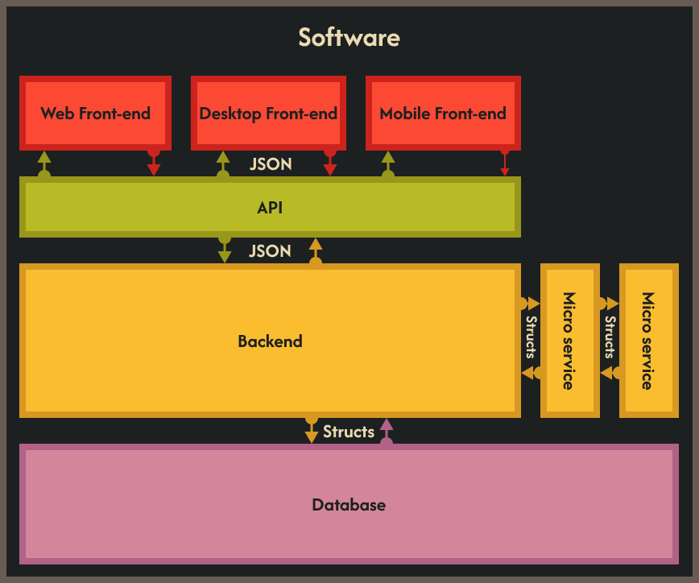
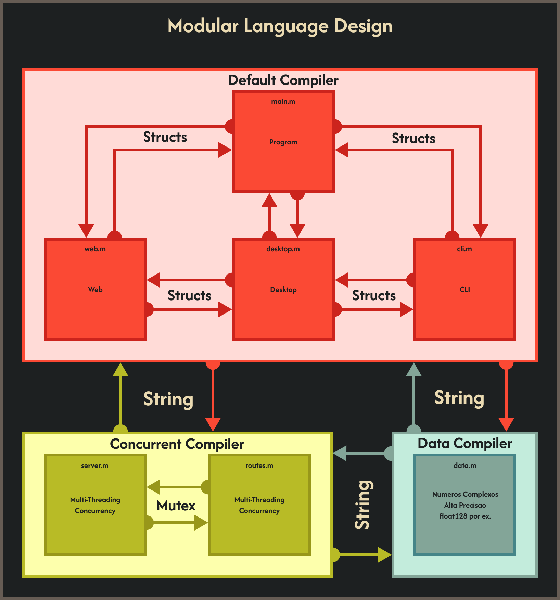
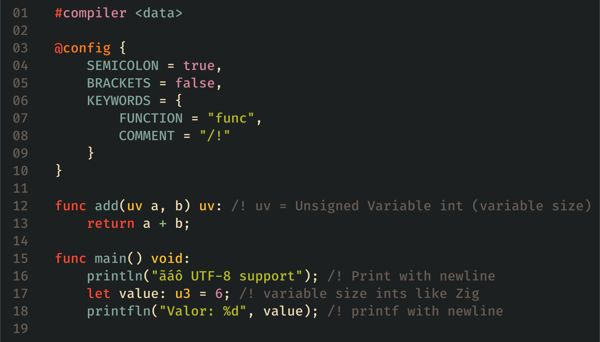
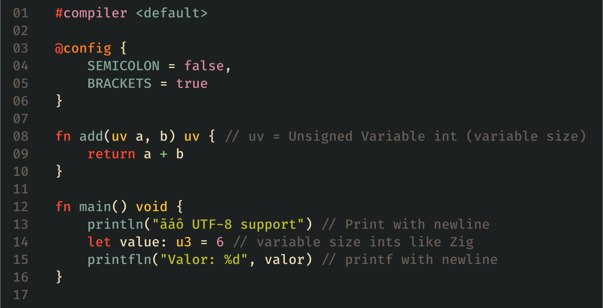

# MODULAR programming language

<picture>
  <source media="(prefers-color-scheme: dark)" srcset="./assets/logo_dark.svg">
  <source media="(prefers-color-scheme: light)" srcset="./assets/logo_light.svg">
</picture>

> [!IMPORTANT]
> This a concept/esoteric programming language in planning stage, there are plans 
> to develop it at some point, but I can't estimate *when* or *if* it will ever 
> happen, so be aware that this concept might be scraped away.

The idea of this language is to be modular in it's compiling options, syntax and
features, providing multiples compilers with specific optimizations for different
scenarios.

This language aims to fix the issue of different languages being adaptated to do
things that they are not supposed or made to, resulting in convoluted framweorks
or libraries, like the infamous [NodeOS](https://node-os.com/docs/).

The inspiration for it is the UNIX philosophy and modern software archtecture.

The UNIX philosophy is stated as the following:

> Write programs that do one thing and do it well.
>
> Write programs to work together.
>
> Write programs to handle text streams, because that is a universal interface.

this language works by providing multiple compilers that optimize differents parts
of your program to specific things, because a programming language is in fact a
computer program, it is their *compiler* or *interpreter*, a programming language
without a compiler or interpreter (which is just an automatic compiler on itself) 
is just text some really weird text that does *nothing* on it's own.

So by providing a bunch of specialized compilers we solve for the first statement.

But *how* we would comunicate between different compiled parts of our program?

Just like software does:

The way that software comunicate between parts is by using common data structures
or data types between them.

and this is how the MODULAR language does:

Files that are compiled using the same compiler can use specific data types or
data structures to comunicate between them, and files compiled with different 
compilers can use a *universal* data type to share data, this type is the
*string* type, because strings (as an array of characters) can represent *any*
data type, you just need to provide the necessary parsing and *"stringfication"* 
functions for it.

so by making this we solve for the last two statements of the UNIX philosophy.

This language also provide customizable syntax, using a special kind of directive, 
called a *meta-directive*, here is an example of it:

The `@config` is a meta-directive, that tells the compiler how to parse this 
given file.

the compiler for this file needs to be specified in the top, otherwise a default
(generic) compiler will be used.

> [!NOTE]
> I'm still thinking if the compiler directive needs to be a pre-processor 
> directive or a meta-directive, changing from #compiler to @compiler.

the `@config` meta directive is used to customize the syntax and other elements
of the language.

> [!NOTE]
> I'm still thinking about the "other elements", maybe the paradigm? like OOP.

here is another example:

You can explicitly specify the default compiler if you want.

One of the things that I plan for this language is arbitrary size and precision
numbers, like `i3`, `u15`, `f23`; and *"generic"* size types like `uv` (unsigned), 
`iv` (signed) and `fv` (float), to allow for a very primitive generics.
